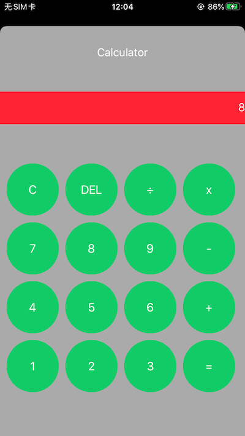

# EasyDev----Developing IOS with Python

## 此为借助python语言的语法开发iOS项目，经过中间件(本项目打包后的Framework)进行解析，转为iOS原生UI和逻辑的组件。

# 项目前景

仅需集成此项目打包后的Framework，即可随时随地使用任何文本编辑工具，用python开发iOS，下发给Framework进行解析执行，即可立马看到效果。

## 当前已经支持的能力：
    1、OC对象创建
    2、OC对象、类的函数调用(函数调用暂未找到通用方法)
    3、OC对象属性赋值取值
    4、python print函数（不支持format）
    5、简单的数组字典定义、取值、赋值
    6、单层if/elif/else控制语句, 单层for循环
    7、简单的四则混合运算，字符串相加

## 当前对python词法解析能力有限，存在以下局限和问题：
    1、不支持数组字典嵌套取值
    2、不支持if/for循环嵌套、函数定义嵌套，for x in range(2),for只能使用此格式
    3、UI类创建，其中的属性和值必须形如:(key=value, key2=value2),key为该UI类已有属性 等号前后不能有空格，逗号后面必须有空格
    4、普通赋值语句等号前后必须有一个空格
    5、暂不支持Python类定义、Python自有库、Python自有函数、OC类定义

## 待完成工作：
    1、增加复杂语句的解析能力。（当前使用正则表达式匹配不同格式和功能的语句，嵌套语句解析能力欠佳，还请广大开发者协助一同完成该工作）
    2、OC类、对象方法的调用需更通用，目前有些类的方法无法通过objc_msgSend和performSelector调用，需要寻找通用函数调用的方法。
    3、支持python中函数内再次定义函数，此形式可用于OC中的block回调，在OC有block回调的地方，传入python函数，即可实现回调功能。
    4、支持python类的定义解析，python类解析后，映射为OC类。
    5、支持多文件加载和管理，python类的导入。
    6、变量作用域问题，目前已声明的变量全局生效。
    8、增加代码调试功能，错误告警功能。
    7、提升源文件解析效率，当前对一行python代码进行解析会经过很多项正则判断其词法属于哪种语法，效率较低，经测试，与OC原有代码执行效率相比，耗时是OC的1~10倍。因一行语句要经过很多层判断、解析，最后才能到达指定的函数去执行。

# 求助
    1、对python源文件的词法解析，例如，如何最快速精准的区分如下几种词法意图：
    if/for/return/continue语句，python函数调用/参数解析，OC类方法/对象方法调用
    
    2、通用的类/对象函数调用方法，参数个数、类型、返回值均不同的情况下，有没有通用的方法能使得形如 returnValue = object.property.func(arg1, arg2, arg3)的函数调用正常执行。

# 示例Demo

如下为示例语法，创建了一个简单的计算器界面，引入了OC类创建，属性赋值，方法调用，数组，for循环语句等语法。

```python
# 主控制器
vc = UIViewController()

# 标题label
label = UILabel(frame=(0,20,375,40), text="Calculator", textColor="#FFFFFF", textAlignment=1)
vc.view.addSubview(label)

# 输入框
field = UITextField(frame=(0,100,375,50), text="0", backgroundColor="#FF2233", textColor="#FFFFFF", textAlignment=2)
vc.view.addSubview(field)

# 按钮背景视图
aview = UIView(frame=(0,200,375,400))
vc.view.addSubview(aview)

btnTitleArr = ["C", "DEL", "÷", "x", "7", "8", "9", "-", "4", "5", "6", "+", "1", "2", "3", "="]
btnw = 80
index = 0
y = 10
# 创建一行4个按钮
def createUI():
    for x in range(4):
        btnx = x * 90 + 10
        btn = UIButton(frame=(btnx,y,btnw,btnw), title=btnTitleArr[index], backgroundColor="#11CC66", cornerRadius=40, target=clicked)
        aview.addSubview(btn)
        index = index + 1
# 创建4行按钮
for x in range(4):
    createUI()
    y = y + 90
print("def functoin")
# 按钮点击响应方法
def clicked(sender):
    field.text = sender.currentTitle
    
print("load done")

createUI()
y = y + 90
```
效果图展示：

 
